# 💰 Sistema de Gestión Financiera

> **Simplifica tu contabilidad personal. Toma el control de tu dinero.**

**Mi Finanzas** es una aplicación de escritorio intuitiva y potente diseñada para ayudarte a gestionar tus ingresos, gastos, ahorros y deudas de forma organizada y segura en tu propia máquina.

A diferencia de las soluciones basadas en la nube, **Mi Finanzas** prioriza la privacidad: todos tus datos se almacenan localmente en una base de datos segura, sin salir nunca de tu ordenador[cite: 0, 2, 3].

---

## 🚀 Características Principales

*   **Registro Total:** Ingresa y clasifica cada movimiento de dinero: Ingresos, Gastos (fijos y variables), Ahorros y Deudas.
*   **Visualización Dinámica:** Pantalla de 'Inicio' con resúmenes instantáneos, distribución porcentual y tendencias mensuales para comprender tus finanzas de un vistazo.
*   **Gestión de Deudas Especializada:** Módulo exclusivo para registrar deudas y sus pagos parciales, con vista del historial de deudas pagadas.
*   **Diseño Moderno y Adaptable:** Interfaz gráfica limpia y oscura (con soporte para tema del sistema) construida con `customtkinter`, optimizada para una experiencia de usuario fluida.
*   **Privacidad Local:** Tus datos están seguros en un archivo de base de datos SQLite local (`finanzas.db`), no en la nube.

---

## 🛠️ Tecnologías y Dependencias

Este proyecto está desarrollado principalmente con Python y utiliza las siguientes bibliotecas clave:

*   **Customtkinter**: Para la interfaz gráfica moderna y personalizable.
*   **Matplotlib**: Para la generación de gráficos estadísticos (tortas y barras).
*   **SQLite**: Para el almacenamiento local de datos.

---

## ⚙️ Instalación para Desarrolladores

Para ejecutar el código fuente (`.py`), necesitarás tener instalado Python (v3.11+ recomendado) en tu sistema.

1.  **Clona el repositorio o descarga el proyecto:**
    ```bash
    git clone [https://github.com/Maicol843/Mi_Finanzas.git](https://github.com/Maicol843/Mi_Finanzas.git)
    cd Mi_Finanzas
    ```

2.  **Crea y activa un entorno virtual (recomendado):**
    ```bash
    python -m venv venv
    # En Windows:
    venv\Scripts\activate
    # En macOS/Linux:
    source venv/bin/activate
    ```

3.  **Instala las dependencias necesarias:**
    Este proyecto no usa un archivo `requirements.txt` genérico para simplificar, instala las bibliotecas directamente:
    ```bash
    pip install customtkinter matplotlib
    ```

4.  **Ejecuta la aplicación:**
    ```bash
    python Mi_Finanzas.py
    ```

---

## 📦 Crear una Versión Ejecutable (.exe)

Si quieres compartir la aplicación como un único archivo `.exe` para Windows (con el icono personalizado), sigue estos pasos:

1.  **Instala PyInstaller:**
    ```bash
    pip install pyinstaller
    ```

2.  **Ejecuta el comando de empaquetado (con el icono `icono.ico`):**
    Este comando creará un archivo único, ocultará la consola y asignará el icono:
    ```bash
    python -m PyInstaller --noconsole --onefile --icon=icono.ico Mi_Finanzas.py
    ```

3.  **Resultado:**
    Encontrarás tu aplicación lista para usar en la carpeta `dist/`, llamada **`Mi_Finanzas.exe`**. Puedes compartir este archivo directamente.

---

## 📈 Galeria de Imágenes

<p align="center">
  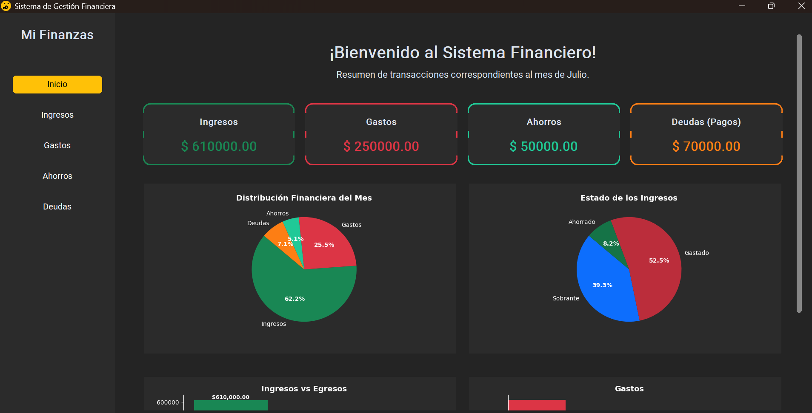
  &nbsp;&nbsp;&nbsp;&nbsp;
  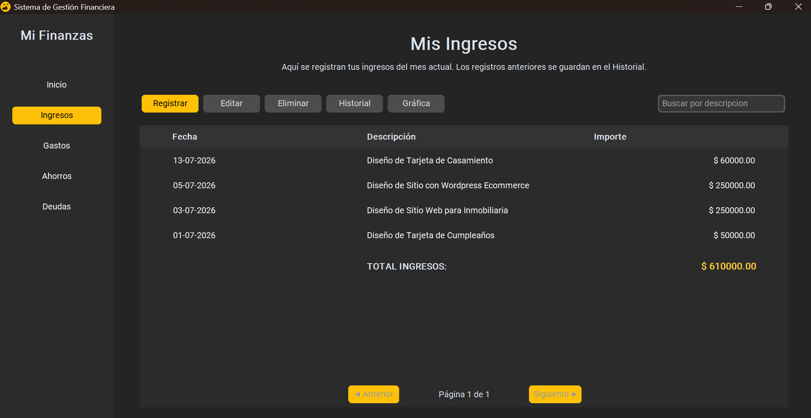
</p>
<p align="center">
  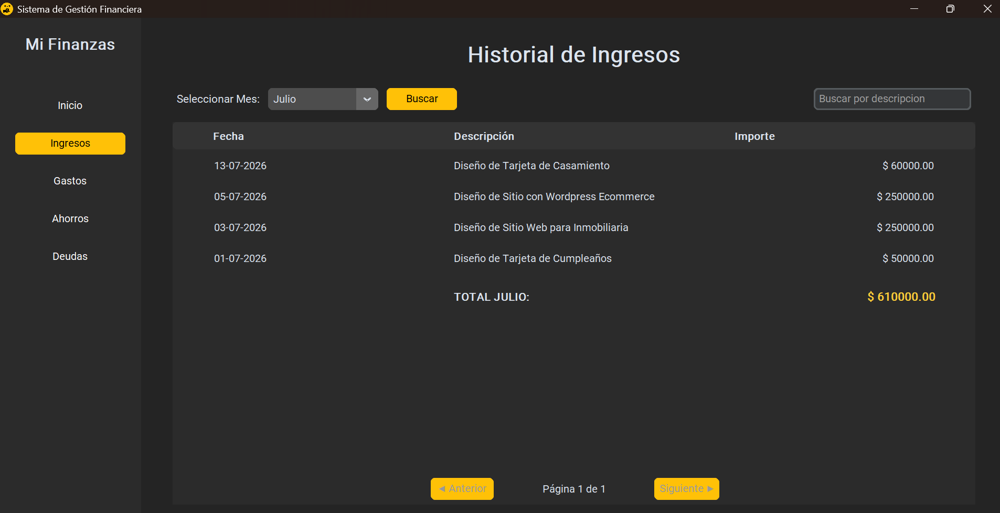
  &nbsp;&nbsp;&nbsp;&nbsp;
  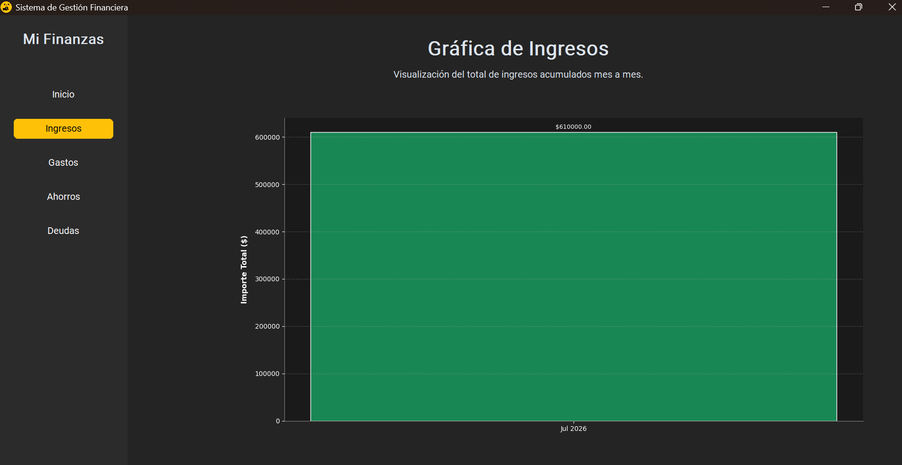
</p>
<p align="center">
  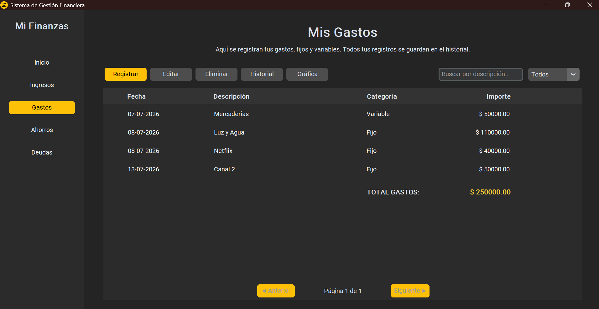
  &nbsp;&nbsp;&nbsp;&nbsp;
  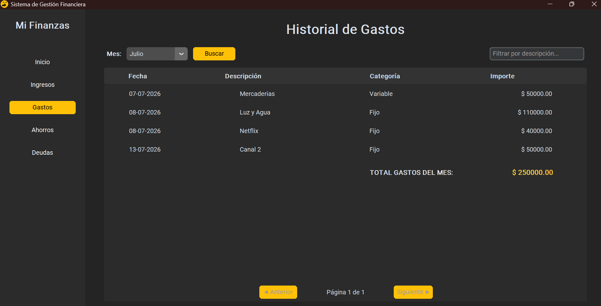
</p>
<p align="center">
  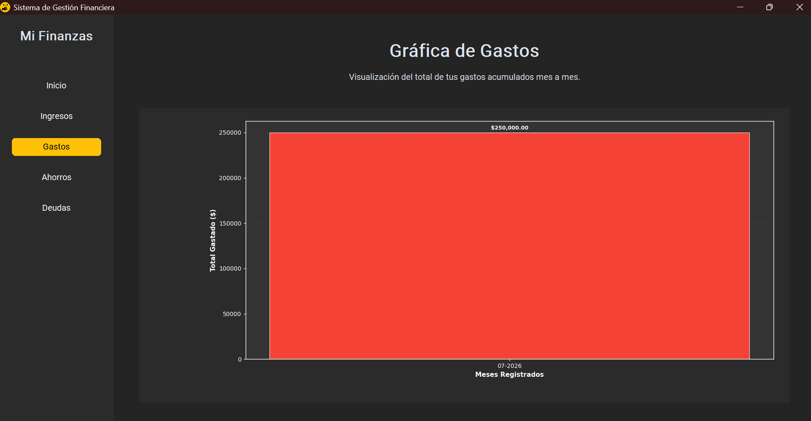
  &nbsp;&nbsp;&nbsp;&nbsp;
  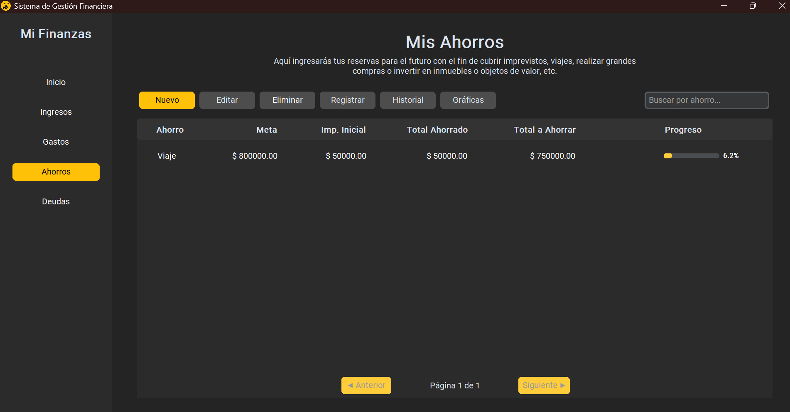
</p>
<p align="center">
  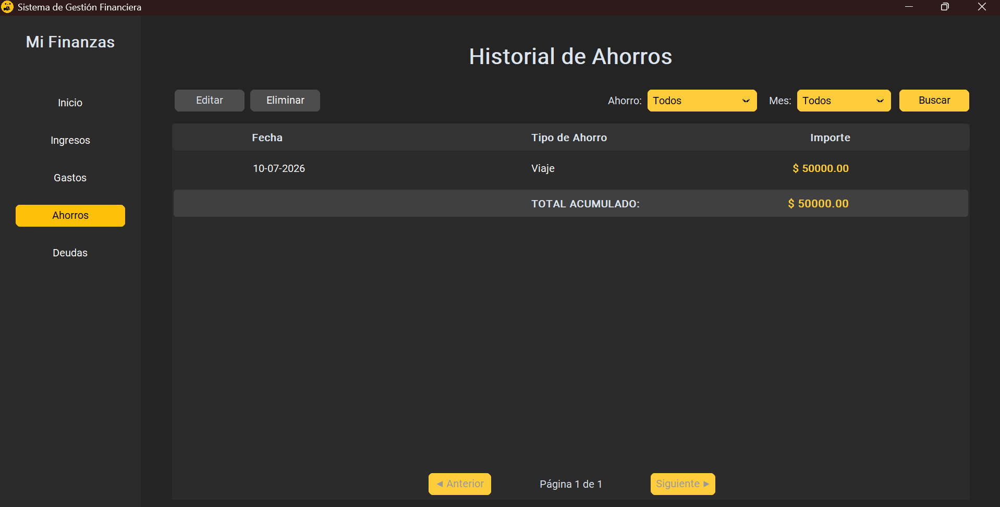
  &nbsp;&nbsp;&nbsp;&nbsp;
  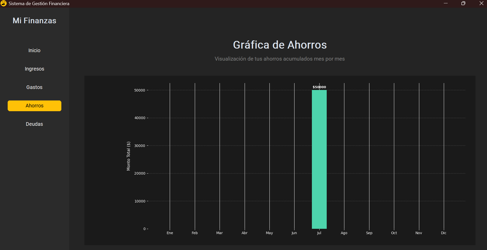
</p>
<p align="center">
  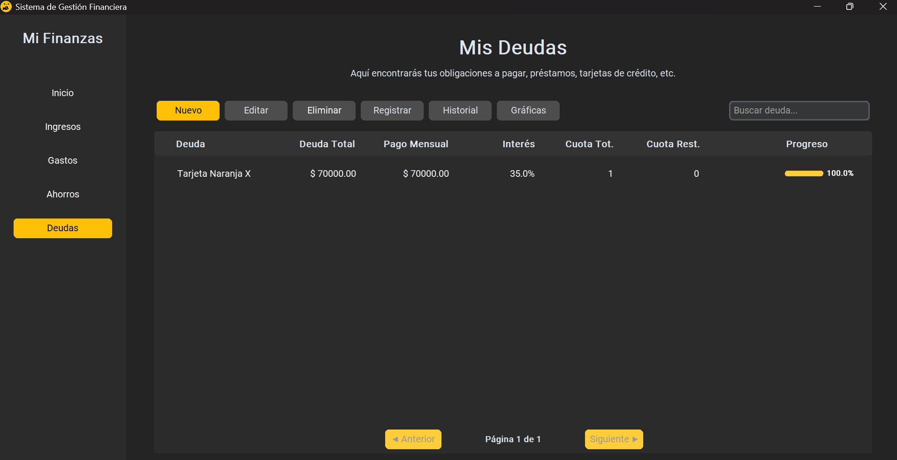
  &nbsp;&nbsp;&nbsp;&nbsp;
  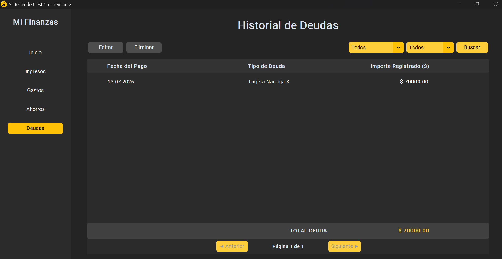
</p>
<p align="center">
  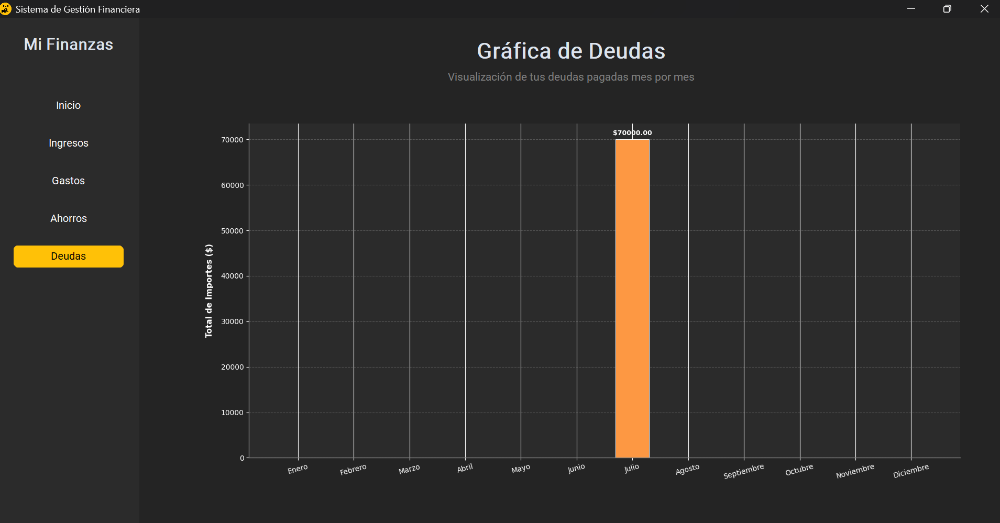
</p>

---

> Hecho para ayudarte a manejar tus finanzas con total privacidad.<br>
> Desarrollado por Maicol Daniel Mamani Chalco
